# HelpDesk Ticket Management System

A full-stack support desk where users raise tickets, admins assign them to engineers, and everyone follows progress through comments, an activity timeline, in-app notifications and email alerts.

Built with **React 19 + Vite + Tailwind CSS 4** on the frontend and **Node.js + Express 5 + MongoDB (Mongoose)** on the backend.

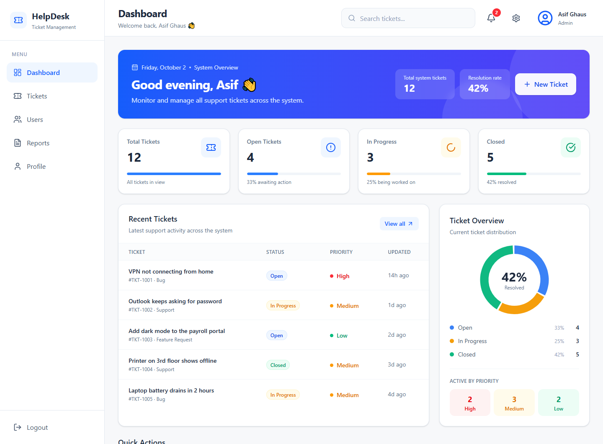

---

## Features

### Tickets
- Create tickets with a title, description, category (Bug, Support, Feature Request) and priority (High, Medium, Low)
- Ticket IDs are generated automatically (`TKT-1001`, `TKT-1002`, …) with an atomic counter, so they never collide
- Status workflow: **Open → In Progress → Closed**
- Server-side search, filtering (status, priority, category) and pagination
- Ticket details page with a conversation thread (comments) and a full activity history
- File attachments (screenshots, PDFs, logs, documents) on the ticket itself or on individual comments: drag and drop, image previews and downloads. Files are stored in MongoDB GridFS, so they survive server restarts

### Roles and access

| Role | What they can do |
|---|---|
| **Owner** | One protected Admin account. Everything an Admin can do, plus creating, editing and removing Admins and transferring ownership. Nobody can delete or demote the Owner |
| **Admin** | See and manage every ticket, assign engineers, change status, delete tickets, manage Engineers and Users, view reports |
| **Engineer** | Work on tickets assigned to them, pick up unassigned tickets with **Assign to me**, update status |
| **User** | Raise tickets, follow and comment on their own tickets |

Access rules are enforced on the backend. The UI only shows the actions a role is allowed to take.

### Notifications
- In-app notification bell with unread count, mark as read, delete and clear all
- Users are notified when:
  - a ticket is created (admins)
  - a ticket is assigned (the engineer)
  - a ticket's status changes (reporter and engineer)
  - a new comment is added (reporter and engineer)
  - a user is added or removed (other admins)
- Email alerts for assignments and status changes (can be turned off in Settings)
- Notifications are removed automatically after 90 days

### Dashboard and reports
- Role-aware dashboard: ticket counts, status breakdown, active tickets by priority, recent tickets
- Reports page:
  - date range filter (7 / 30 / 90 days / all time)
  - created vs closed trend
  - average resolution time (from when each ticket was opened to when it was closed)
  - status, priority and category charts
  - engineer workload
  - CSV export

### Accounts
- Email and password login, plus **Continue with Google** (Firebase Authentication)
- Forgot password / reset password by email (links expire after 15 minutes)
- Profile page with photo upload, contact details and password change
- Admin user management: create, edit, deactivate and delete users, with search and filters

### Experience
- Light and dark themes, plus a compact mode, saved to the account so they follow the user across devices
- Responsive layout with a slide-in sidebar on mobile
- Toast messages, loading skeletons and empty states

### Security
- Passwords hashed with bcrypt; JWT authentication
- Request validation on every write route (types, email and phone format, lengths, allowed values), so bad input gets a clear `400`
- The role and status of each request are re-checked against the database, so a deactivated or demoted user loses access immediately
- Role hierarchy: only the Owner can create, edit or remove Admins, and the Owner account can't be deleted or demoted
- Changing or resetting a password signs out every other session
- Google sign-in only accepts email addresses Google has verified
- The activity history is written by the server only and can't be edited through the API
- `helmet` security headers and a CORS allow-list
- Rate limiting on login, Google login, forgot password and reset password
- Request size limits and a JSON error handler

---

## Screenshots

> Shown with demo data.

| Tickets | Ticket details |
|---|---|
| 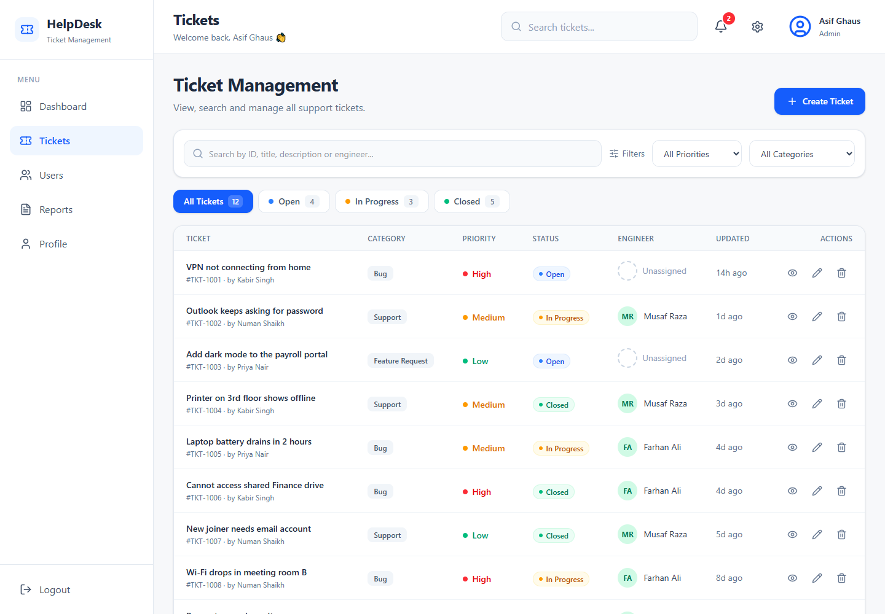 | 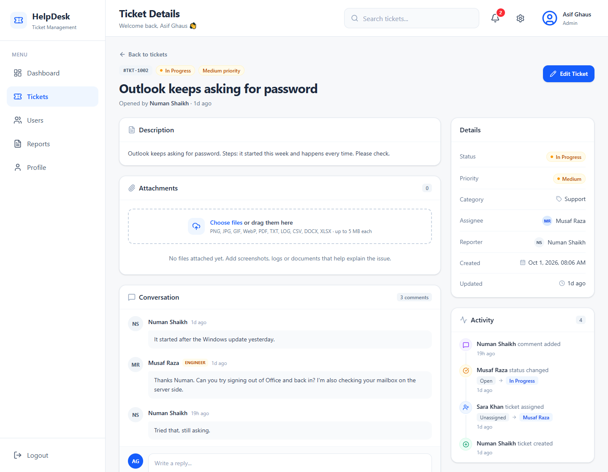 |
| **Create ticket** | **Reports** |
| 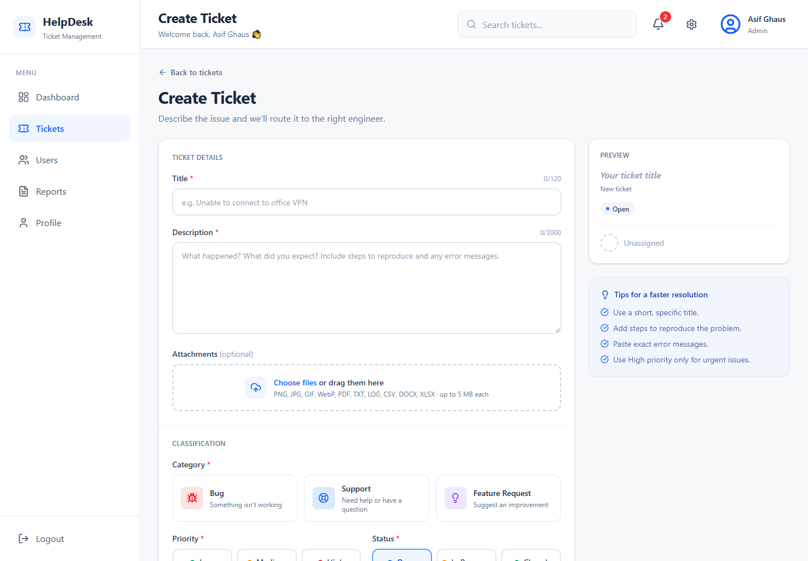 | 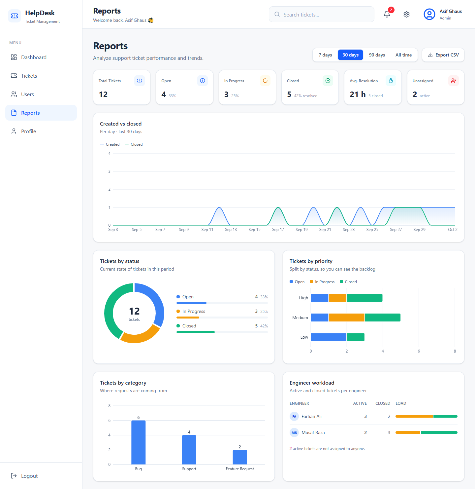 |
| **User management** | **Notifications** |
| 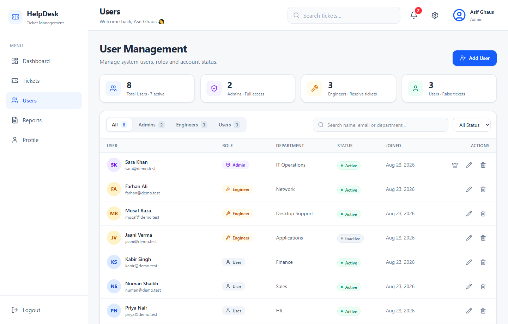 | 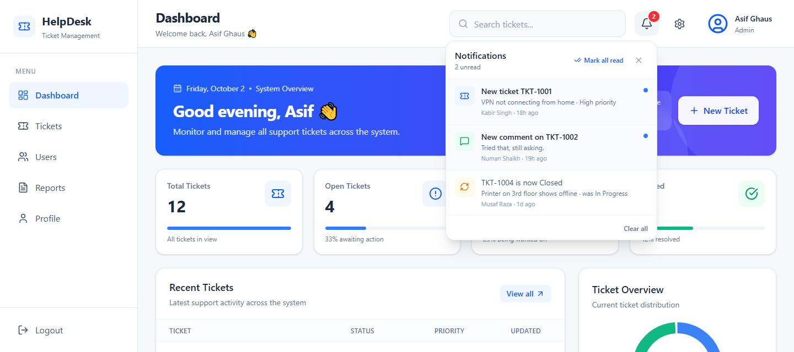 |
| **Sign in** | **Dark mode** |
| 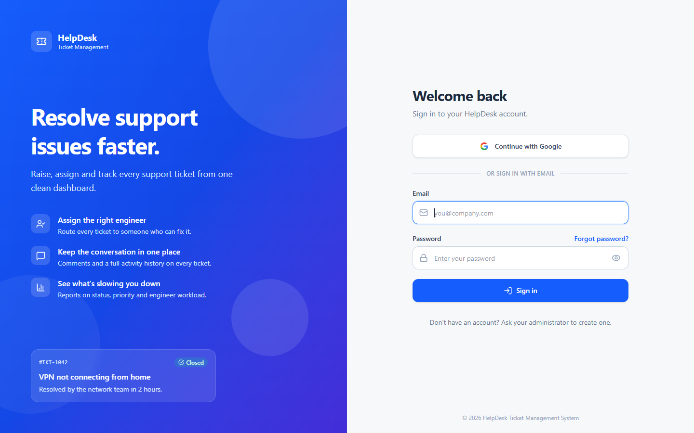 | 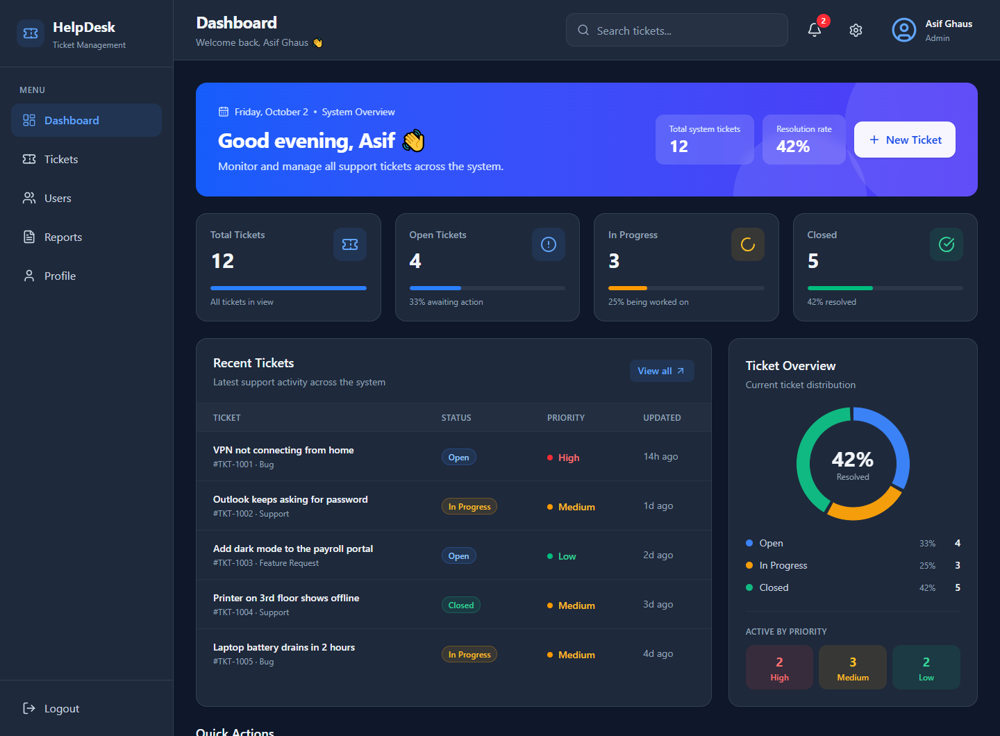 |

<details>
<summary><strong>More: dark ticket details and mobile</strong></summary>

<br>

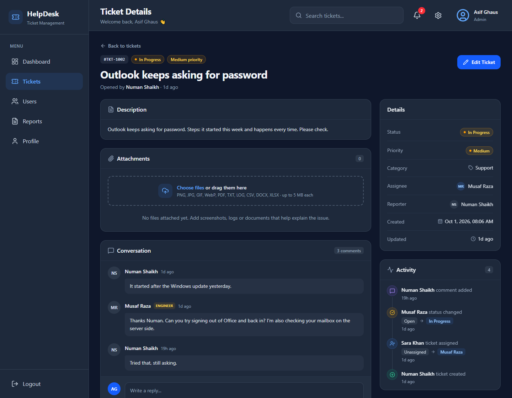

<p>
  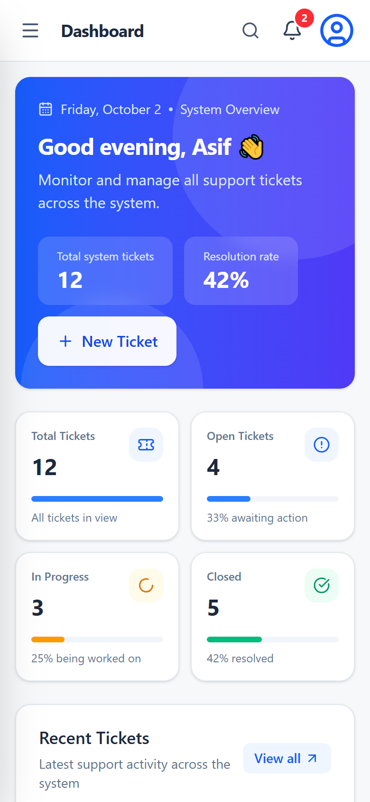
  &nbsp;&nbsp;
  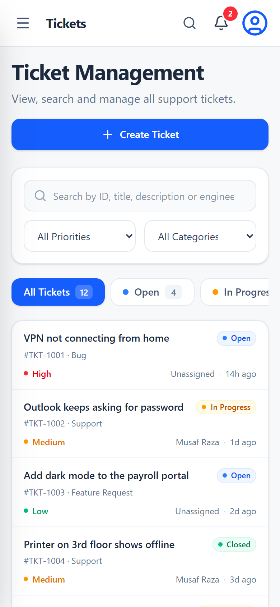
</p>

</details>

---

## Tech stack

| Layer | Technology |
|---|---|
| Frontend | React 19, Vite 7, React Router 7, Tailwind CSS 4, Recharts, lucide-react, react-hot-toast |
| Backend | Node.js, Express 5, Mongoose 9 (MongoDB), Multer + GridFS for file uploads |
| Auth | JSON Web Tokens, bcryptjs, Firebase Authentication (Google sign-in) |
| Email | Nodemailer (SMTP) |
| Security | helmet, express-rate-limit, CORS |

---

## Project structure

```
HelpDesk-Ticket-Management-System/
├── backend/
│   ├── src/
│   │   ├── config/        # MongoDB and Firebase Admin setup
│   │   ├── controllers/   # Route handlers (auth, tickets, comments, users, …)
│   │   ├── middleware/    # Auth, role checks, rate limiting
│   │   ├── models/        # Mongoose schemas
│   │   ├── routes/        # Express routers
│   │   ├── services/      # Email and notification sending
│   │   ├── utils/         # Access rules, query helpers
│   │   └── server.js      # App entry point
│   ├── .env.example
│   └── package.json
└── frontend/
    ├── src/
    │   ├── components/    # Layout, tickets, dashboard, auth, shared UI
    │   ├── pages/         # One file per screen
    │   ├── routes/        # Route definitions and protected routes
    │   ├── utils/         # Auth helpers, formatting, notifications API
    │   ├── config.js      # API base URL
    │   └── firebase.js    # Firebase client (Google sign-in)
    ├── .env.example
    └── package.json
```

---

## Getting started

### Prerequisites

- **Node.js 20.19 or newer** (required by Mongoose 9)
- A **MongoDB** database, local or [MongoDB Atlas](https://www.mongodb.com/atlas)
- An **SMTP** account for emails (for example a Gmail app password)
- *Optional:* a **Firebase** project for Google sign-in

### 1. Clone the repository

```bash
git clone https://github.com/asifghaus350/helpdesk-management-system.git
cd helpdesk-management-system
```

### 2. Set up the backend

```bash
cd backend
npm install
cp .env.example .env
```

Fill in `backend/.env`:

| Variable | Description |
|---|---|
| `PORT` | API port (default `5000`) |
| `MONGO_URI` | MongoDB connection string |
| `JWT_SECRET` | Long random string used to sign login tokens |
| `FRONTEND_URL` | Frontend URL(s), comma-separated. Used for CORS and for links in emails |
| `SMTP_HOST`, `SMTP_PORT`, `SMTP_USER`, `SMTP_PASSWORD` | SMTP settings for password-reset and notification emails |
| `FIREBASE_SERVICE_ACCOUNT_PATH` | *Optional.* Path to the Firebase service-account JSON for Google sign-in |

Start the API:

```bash
npm run dev      # development, restarts on changes
npm start        # production
```

The API runs at `http://localhost:5000`.

### 3. Set up the frontend

```bash
cd ../frontend
npm install
cp .env.example .env
```

Fill in `frontend/.env`:

| Variable | Description |
|---|---|
| `VITE_API_URL` | Backend URL, for example `http://localhost:5000` |
| `VITE_FIREBASE_*` | *Optional.* Firebase web app config for Google sign-in |

Start the app:

```bash
npm run dev
```

Open `http://localhost:5173`.

> If the Firebase variables are left empty, the app still works. Only the **Continue with Google** button is disabled.

### 4. Create the Owner (first admin)

Public registration always creates a **User** account. To make the first Admin:

1. Sign in once with **Continue with Google**, or create an account with `POST /api/auth/register`.
2. From the `backend` folder, run:

   ```bash
   npm run make-owner -- you@example.com
   ```

3. Log out and log back in.

That account becomes the **Owner**, an Admin who can't be deleted or demoted by other Admins. The Owner can then create every other user from the **Users** page. The same command also recovers access if the Owner account is ever lost.

> If no Owner exists when the server starts, the oldest active Admin is made the Owner automatically.

---

## Available scripts

| Folder | Command | What it does |
|---|---|---|
| `backend` | `npm run dev` | Start the API with nodemon |
| `backend` | `npm start` | Start the API with Node |
| `backend` | `npm run make-owner -- <email>` | Make an existing account the Owner |
| `backend` | `npm test` | Run the backend unit tests (Node test runner) |
| `frontend` | `npm run dev` | Start the Vite dev server |
| `frontend` | `npm run build` | Build the production bundle into `dist/` |
| `frontend` | `npm run preview` | Preview the production build |
| `frontend` | `npm run lint` | Run ESLint |
| `frontend` | `npm test` | Run the frontend unit tests (Vitest) |

---

## API overview

All routes are prefixed with `/api`. Apart from login, register, Google login and the password-reset routes, every route needs an `Authorization: Bearer <token>` header.

<details>
<summary><strong>Auth</strong> — <code>/api/auth</code></summary>

| Method | Route | Description |
|---|---|---|
| POST | `/register` | Create a User account |
| POST | `/login` | Log in with email and password |
| POST | `/google` | Log in with a Firebase ID token |
| GET | `/me` | Current user, including preferences |
| PUT | `/change-password` | Change own password |
| POST | `/forgot-password` | Email a password-reset link |
| POST | `/reset-password/:token` | Set a new password |

</details>

<details>
<summary><strong>Tickets</strong> — <code>/api/tickets</code></summary>

| Method | Route | Description |
|---|---|---|
| GET | `/` | List tickets. Optional query: `page`, `limit`, `search`, `status`, `priority`, `category`, `assigned=unassigned`. Without `page`, returns the full list |
| GET | `/stats` | Counts by status and priority, unassigned count, recent tickets (`?recent=5`) |
| POST | `/` | Create a ticket |
| GET | `/:id` | Get one ticket by ticket ID (for example `TKT-1001`) |
| PUT | `/:id` | Update a ticket. Engineers can send `{ "assignToMe": true }` for an unassigned ticket |
| DELETE | `/:id` | Delete a ticket (Admin only) |

</details>

<details>
<summary><strong>Comments</strong> — <code>/api/comments</code></summary>

| Method | Route | Description |
|---|---|---|
| GET | `/ticket/:ticketId` | Comments on a ticket |
| POST | `/ticket/:ticketId` | Add a comment |
| PUT | `/:id` | Edit own comment |
| DELETE | `/:id` | Delete own comment (admins can delete any) |

</details>

<details>
<summary><strong>Activity</strong> — <code>/api/activities</code></summary>

| Method | Route | Description |
|---|---|---|
| GET | `/ticket/:ticketId` | Activity history of a ticket |

</details>

<details>
<summary><strong>Attachments</strong> — <code>/api/attachments</code></summary>

Allowed types: PNG, JPG, GIF, WebP, PDF, TXT, LOG, CSV, DOCX and XLSX. Up to 5 files per upload, 5 MB each.

| Method | Route | Description |
|---|---|---|
| GET | `/ticket/:ticketId` | Files attached to a ticket |
| POST | `/ticket/:ticketId` | Upload files (`multipart/form-data`, field `files`; optional `commentId` to attach them to one of your own comments) |
| GET | `/:id/download` | Download a file (`?inline=1` previews images and PDFs) |
| DELETE | `/:id` | Delete a file (uploader or Admin) |

</details>

<details>
<summary><strong>Users</strong> — <code>/api/users</code></summary>

| Method | Route | Description |
|---|---|---|
| GET | `/` | List users (Admin). Optional query: `page`, `limit`, `search`, `role`, `status` |
| GET | `/:id` | Get one user (Admin) |
| POST | `/` | Create a user (Admin) |
| PUT | `/:id` | Update a user (Admin) |
| DELETE | `/:id` | Delete a user (Admin) |
| PUT | `/profile` | Update own name, email and phone |
| PUT | `/profile/photo` | Upload or remove own profile photo |
| PUT | `/profile/preferences` | Save own theme and notification settings |
| POST | `/:id/transfer-ownership` | Make another active Admin the Owner (Owner only) |

</details>

<details>
<summary><strong>Notifications</strong> — <code>/api/notifications</code></summary>

| Method | Route | Description |
|---|---|---|
| GET | `/` | Own notifications (`?limit=20`) plus unread count |
| GET | `/unread-count` | Unread count only |
| PATCH | `/:id/read` | Mark one as read |
| PATCH | `/read-all` | Mark all as read |
| DELETE | `/:id` | Delete one |
| DELETE | `/` | Clear all |

</details>

---

## Deployment

The frontend and backend are deployed separately. For example, the backend can go on Render or Railway and the frontend on Vercel or Netlify.

1. Deploy the **backend** and set every variable from `backend/.env.example`. Set `FRONTEND_URL` to the deployed frontend URL.
2. Deploy the **frontend**:
   - build command: `npm run build`
   - output folder: `dist`
   - set `VITE_API_URL` to the deployed backend URL
3. If you use Google sign-in, add the frontend domain to **Authorized domains** in the Firebase console.

---

## Testing

```bash
cd backend && npm test     # validation, query and upload rules
cd frontend && npm test    # formatting, file checks and permission helpers
```

The tests run without a database or a running server, so they are safe to run anywhere, including CI.

---

## License

Released under the [MIT License](LICENSE).
